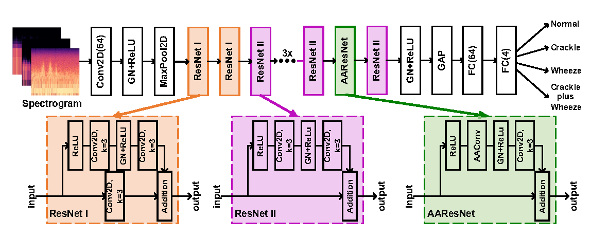
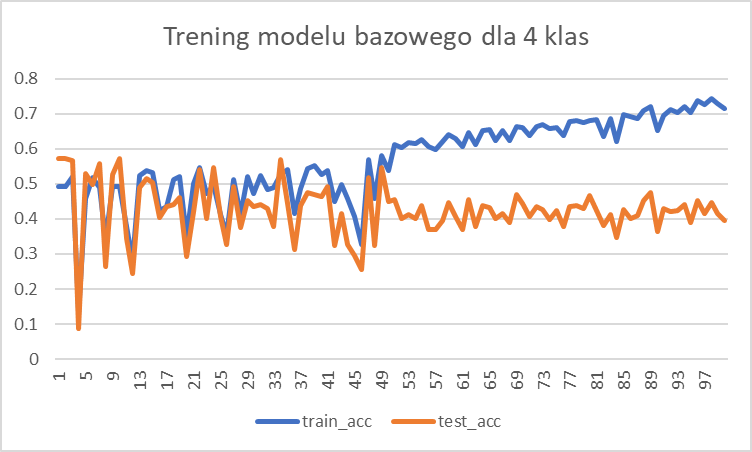
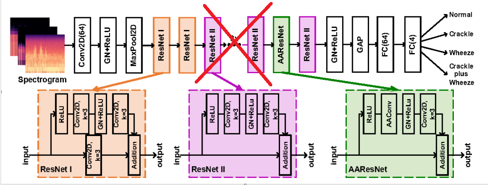
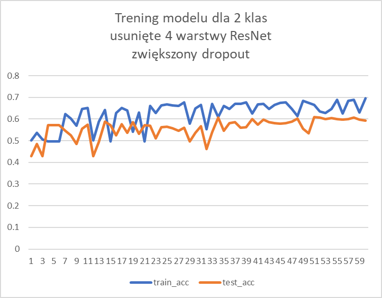
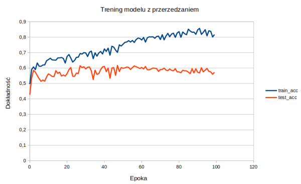
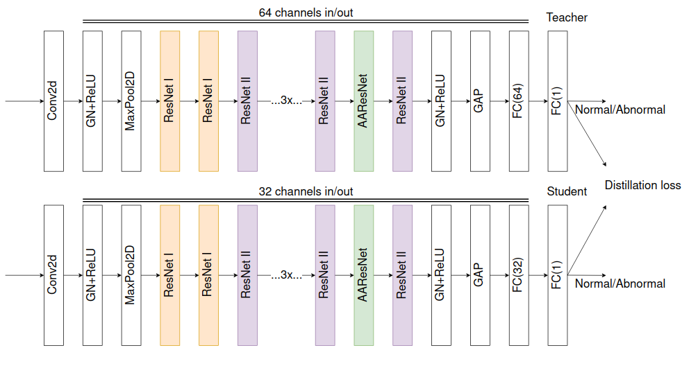
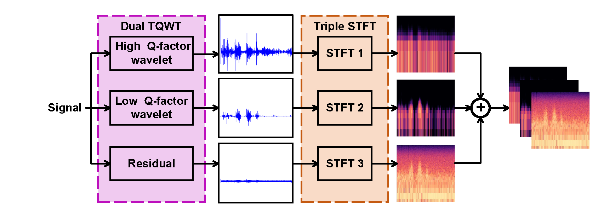
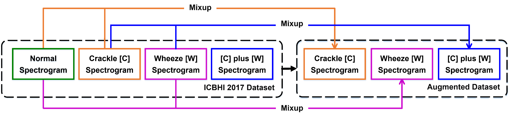
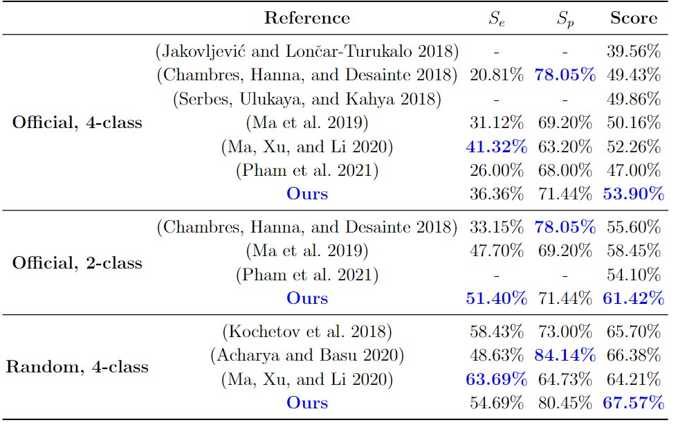
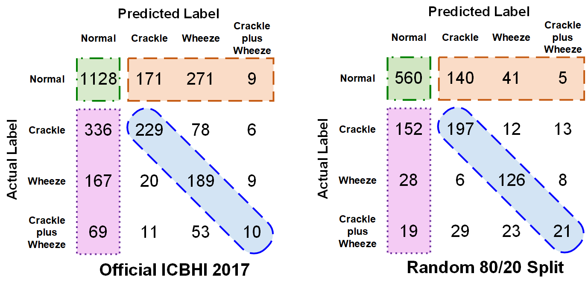

## Optymalizacja struktur i obliczeń w sieciach neuronowych

Autorzy: Piotr Durawa i Jakub Kwiatkowski

## Etap I - Wybór zagadnienia do realizacji

**Zagadnienie**: Klasyfikacja nagrań cykli oddechowych w celu rozpoznawania potencjalnych oznak chorób układu oddechowego.

**Uzasadnienie wyboru celu**: W tradycyjnym podejściu rozpoznawanie oznak chorób układu oddechowego takich jak świsty, trzaski wymaga zaangażowania lekarza i wiąże się z **oceną subiektywną**. Wykorzystanie technik uczenia głębokiego może pozwolić na zbudowanie urządzeń wspomagających eksperta.

**Czego oczekuje się od optymalizacji?**

Optymalizacja może w tym przypadku umożliwić wykorzystanie modelu na urządzeniach medycznych o ograniczonych zasobach sprzętowych lub urządzeniach przenośnych służących potencjalnie do monitorowania oddechu. Istotne jest w tym celu **skrócenie czasu wnioskowania** oraz **redukcja rozmiaru modelu**.

**Zbiór danych**: ICBHI Respiratory Sound Database [[1]](#ref1) <br>
Zbiór ten zawiera 5.5 godzin nagrań składających się z 6898 cykli oddechowych. Dane oznaczone są klasami:

- crackles (trzaski) - 1864 próbki,
- wheezes (świsty) - 886 próbek,
- both (świsty i trzaski) - 506 próbek,
- oddech normalny - 3642 próbki <br>

Dane były zbierane z wykorzystaniem czterech różnych urządzeń. Nagrania są o różnej długości. Były zbierane z 7 różnych części ciała w trybie multi channel (jednocześnie) lub single channel (sekwencyjnie).

**Zadania**:

- klasyfikacja 4-klasowa: {oddech w normie, świst, trzask, świst i trzask} - **podstawowe**
- klasyfikacja 2-klasowa: {oddech w normie, oddech nieprawidłowy} - **pochodne**

Klasa “oddech nieprawidłowy” agreguje próbki należące do klas {świst, trzask, świst i trzask}.

**Reprezentacja**: Mel-spektrogram/MFCC

## ETAP II - Wybór danych i modelu

**Zbiór danych**: ICBHI Respiratory Sound Database [[1]](#ref1)
Zbiór ten zawiera 5.5 godzin nagrań składających się z 6898 cykli oddechowych. Dane oznaczone są klasami:

- crackles (trzaski) - 1864 próbki,
- wheezes (świsty) - 886 próbek,
- both (świsty i trzaski) - 506 próbek,
- oddech normalny - 3642 próbki

Dane były zbierane z wykorzystaniem czterech różnych urządzeń. Nagrania są o różnej długości. Były zbierane z 7 różnych części ciała w trybie multi channel (jednocześnie) lub single channel (sekwencyjnie).

**Model**: LungAttn [[1]](#ref1) [[2]](#ref2)

Model LungAttn bazuje na architekturze ResNet. Autorzy wprowadzili do modelu warstwy splotowe rozszerzone o mechanizm atencji (ang. Attention augmented convolution, AAConv). Polega to na niezależnym przetworzeniu wejściowej mapy cech przez warstwę splotową oraz mechanizm atencji, a następnie konkatenacji wyjściowych map cech. Wykorzystanie mechanizmu atencji uzasadnione zostało potrzebą uwzględnienia zależności czasowych i częstotliwościowych na spektrogramach bez względu na lokalizację cech na obrazie. Architekturę modelu przedstawiono na rysunku 1. Na początku zastosowano warstwę splotową, normalizacji grupowej (ang. group normalization, GP), poolingu oraz kilka bloków ResNet, aby dokonać ekstrakcji map cech o **dużym polu recepcyjnym**, która następnie jest przetwarzana przez bloczek zawierający AAConv w celu uwzględnienia **globalnych interakcji pomiędzy cechami**. Wyjście bloczku AAResNet przetwarzane jest dalej przez kolejny bloczek ResNet II, warstwę normalizacji grupowej, warstwę poolingu, a na końcu przez warstwy w pełni połączone (ang. fully-connected, FC). Po warstwach w pełni połączonych umieszczono warstwy Dropout.



Rys. 1. Diagram przedstawiający architekturę modelu LungAttn [[1]](#ref1).

**Uzasadnienie wyboru danych i modelu**:
Zbiór danych wynikał z przyjętego zagadnienia, które wybrano tak, aby możliwe było określenie nowego zadania na zbiorze danych. Jednocześnie wybrano zbiór benchmarkowy pozwalający na porównywanie wyników. Kierowano się również aspektami praktycznymi. Zadbano o to, aby zbiór danych nie był zbyt złożony w stosunku do wymagań projektu.
Model wybrano spośród dostępnych na stronie Papers With Code dla zagadnienia klasyfikacji nagrań cykli oddechowych [[3]](#ref3). Podczas wyboru modelu kierowano się tym, aby nie był zbyt duży w stosunku do złożoności zagadnienia oraz był możliwy jego trening na platformie sprzętowej o ograniczonych zasobach.

**Scharakteryzowanie oryginalnych danych**:

Główne cechy charakterystyczne zbioru danych [[4]](#ref4) przedstawiono w tabeli 1.

Tabela 1. Charakterystyka zbioru danych.
Zbiór klas
| Informacja | Dane
| -------------------------- | ------------------------------------------------------------------------------- |
| Zbiór klas | {oddech w normie, świst, trzask, świst i trzask} |
| Liczba przykładów na klasę | {3642 ,886, 1864, 506 } |
| Format danych | audio, rozszerzenie .wav, częstotliwość próbkowania 44.1 kHz, bitrate 1058 kbps |
| Łączny czas nagrań audio | 5.5 h |
| Liczba pacjentów | 126 |

Dane były zbierane z 7 różnych lokalizacji klatki piersiowej. Dane są heterogeniczne - zbierane były za pomocą czterech różnych urządzeń:

- AKG C417L Microphone,
- 3M Littmann Classic II SE Stethoscope,
- 3M Litmmann 3200 Electronic Stethoscope,
- WelchAllyn Meditron Master Elite Electronic Stethoscope

Z danych najpierw wycięto cykle oddechowe za pomocą skryptu _clip_breath_cycles.py_. Następnie wykonano preprocessing, w którym dane zostały przetworzone do postaci spektrogramów. Różne parametry transformaty TQWT [[1]](#ref1) pozwoliły uzyskać dla każdego cyklu trzy spektrogramy o różnej charakterystyce. Wykorzystano domyślne parametry transformaty TQWT dostępne w repozytorium projektu [[2]](#ref2).

**Scharakteryzowanie oryginalnego modelu**:

Charakterystykę oryginalnego modelu LungAttn przedstawiono w tabeli 2. Dane statystyczne wyznaczono po treningu modelu przez 100 epok. W przypadku pomiaru czasu wnioskowania na GPU wykorzystano zalecenia podane na blogu Geifmana [[5]](#ref5). Obliczenia wykonywane równolegle na CPU i GPU są asynchroniczne. Oznacza to, że CPU po skończeniu pracy może przejść do wykonywania dalszych działań np. pomiaru czasu, nawet jeśli proces obliczeniowy na GPU jeszcze się nie skończył. Z tego względu wykorzystano metodę torch.cuda.Event() do pomiaru czasu na GPU oraz metodę torch.cuda.synchronize(), aby zatrzymać CPU aż do czasu skończenia obliczeń na GPU. Przed wykonaniem testów właściwych przeprowadzono 10 iteracji rozgrzewkowych w celu inicjalizacji GPU. Porcja danych, na której wykonywano pomiary została przeniesiona na GPU przez rozpoczęciem procedury, zatem otrzymane wyniki nie uwzględniają czasu potrzebnego na przeniesienie danych do pamięci GPU.

Tabela 2. Charakterystyka oryginalnego modelu LungAttn.
|Informacja| Dane
----------------------------------------------- | ---------------------------------------------------- |
Liczba parametrów | 711 900  
| Rozmiar modelu | 2.716 MB |
| Czas treningu pojedynczej epoki (batchsize 128) | średnia: 11.99 s, odchylenie standardowe 0.42 s |
| Wymagania pamięciowe (batchsize 128) | 2600 MiB VRAM |
| Czas inferencji na GPU (1 próbka) | średnia: 1.231 ms, odchylenie standardowe 0.183 ms |
| Czas inferencji na CPU (1 próbka) | średnia: 4.941 ms, odchylenie standardowe:

## ETAP III - Określenie zadania docelowego i przygotowanie danych

Do nowego zadania został przygotowany nowy zbiór danych. Oryginalny zbiór danych prezentuje się następująco:

- crackles (trzaski) - 1864 próbki,
- wheezes (świsty) - 886 próbek,
- both (świsty i trzaski) - 506 próbek,
- oddech normalny - 3642 próbki

Trening modelu bazowego dla 4 klas wygląda następująco. Podczas treningu można zauważyć overfitting po około 50 epoce. Wyniki walidacyjne po 50 epoce są niższe.


Rys. 2. Wykres przedstawiający trening dla modelu bazowego dla 4 klas

W nowym zbiorze danych połączono próbki “crackles”, “wheezes” oraz “both”. Umożliwia to podzielenie zbioru na klasę, gdzie nie występują żadne zaburzenia oddechu i klasę, gdzie występują trzaski lub/i świsty w oddechu. W rezultacie otrzymano dwie klasy:

- oddech nienormalny- 3256 próbki,
- oddech normalny - 3642 próbki

Próbki zostały zaszumione poprzez wykorzystanie funkcji, która odwraca podaną wartość z określonym prawdopodobieństwem. W bibliotece random ustawiono ręcznie zadane ziarno dla generatora liczb pseudolosowych, aby zapewnić powtarzalność wyników.

```python
def flip_with_probability(value, probability):
  if random.random() < probability:
    return 1 - value
  else:
    return value
```

Do kodu źródłowego została zaimplementowana utworzona funkcja.

```python
if crackles == 0 and wheezes == 0:
  label = flip_with_probability(0, probability_of_flip)
else:
  label = flip_with_probability(1, probability_of_flip)
```

Utworzono zbiory danych z zaszumieniem wynoszącym 1%, 5% i 10%.

## ETAP IV - Douczenie oraz pomiary modelu odniesienia (baseline)

Nowy zbiór wymaga klasyfikacji binarnej, dlatego na końcu modelu wykorzystano funkcję Sigmoid. Oryginalny model został douczony do nowego zadania poprzez zamrożenie pierwszej warstwy splotowej oraz wszystkich bloków ResNet. Nowa architektura sieci prezentuje się następująco:

```python
x = self.conv1(x) # zamrożona
x = self.ResNet_0_0(x) # zamrożona
x = self.ResNet_0_1(x) # zamrożona
x = self.ResNet_0(x) # zamrożona
x = self.ResNet_1(x) # zamrożona
x = self.ResNet_2(x) # zamrożona
x = self.ResNet_3(x) # zamrożona
x = self.ResNet_4(x) # zamrożona
x = self.ResNet_5(x) # zamrożona
x = self.ResNet_6(x) # zamrożona
x = self.norm0(x)
x = self.relu0(x)
x = self.pool0(x)
x = self.flat(x)
x = self.linear1(x)
x = self.dropout1(x)
x = self.linear2(x)
x = self.dropout2(x)
x = self.output_sigmoid(x) # nowe wyjście
```

Ogólne hiperparametry wykorzystywane podczas uczenia modeli w tym oraz w kolejnych podpunktach przedstawiono w tabeli 3. Do uczenia wykorzystano optymalizator SGD [[6]](#ref6) oraz scheduler StepLR [[7]](#ref7).

Tabela 3. Hiperparametry podczas treningu modelu binarnego.
Funkcja straty | Optymalizator | momentum | Learning rate (początkowa wartość) | weight decay | Scheduler step, gamma | dropout0,dropout1,dropout2 | Liczba kluczy, wartości oraz głów warstwy atencji |
| ----------------------------------------------------------- | ------------- | -------- | ------------------------------------ | ------------ | --------------------- | ----------------------------- | ------------------------------------------------- |
| BCELoss()[[8]](#ref8) | SGD | 0.9 | 0.1 | 0.0 | (50, 0.1) | (0.25, 0.25, 0.25) | (20, 4, 2) |

Model wytrenowany na oryginalnym zbiorze (4 klasy) został wytrenowany na 100 epokach. Następnie model binarny został dotrenowany na 30 epokach. Obniżono learning rate z 0.1 do 0.01. Poniżej przedstawiono wyniki dotrenowanych modeli z 3 różnymi poziomami zaszumienia zbioru.

Tabela 4. Miary dokładności działania modelu odniesienia przy różnych poziomach zaszumienia.
| Poziom zaszumienia [%] | test_acc | test_se | test_sq | test_score |
| ---------------------- | -------- | ------- | ------- | ---------- |
| 0 | 0.567 | 0.565 | 0.570 | 0.567 |
| 1 | 0.561 | 0.537 | 0.592 | 0.565 |
| 5 | 0.573 | 0.601 | 0.536 | 0.568 |

Najlepsze wyniki osiągnął model z poziomem zaszumienia na poziomie 5%.

Tabela 5. Czas inferencji, wymagania pamięciowe oraz rozmiar modelu dla modelu odniesienia.
| Liczba parametrów | Rozmiar modelu [MB] | Czas inferencji CPU | Czas inferencji GPU | Zajętość VRAM (batchsize 32) | Czas uczenia pojedynczej epoki |
| ----------------- | ------------------- | ----------------------------- | ----------------------------- | ---------------------------- | ------------------------------ |
| 711705 | 2.715 | mean: 4.89 ms <br> std: 1.44 ms | mean: 1.03 ms <br> std: 0.26 ms | ~1450 MB | ~ 7.00 sekund |

## ETAP V - Upraszczanie modelu

Podczas treningu bazowego modelu dla 4 warstw zauważalne było duże przetrenowanie. W celu zmniejszenia rozmiaru modelu oraz ograniczenia zjawiska przetrenowania podjęto próby uproszczenia modelu. Zastosowano:

### 1. Usunięcie 4 warstw ResNet przed treningiem.



Rys. 3. Diagram przedstawiający zmodyfikowaną architekturę modelu LungAttn [[1]](#ref1).

Po usunięciu 4 warstw ResNet i dostosowaniu modelu do nowego zadania zostały ponownie przeprowadzone testy. Na poniższym wykresie został zaprezentowany przebieg treningu i ewaluacji nowego modelu. Hiperparametry były takie same jak podczas uczenia modelu odniesienia.



Rys. 4. Wykres przedstawiający trening dla zmodyfikowanego modelu dla 2 klas.

Na wykresie można zauważyć, że uproszczenie architektury modelu pomogło w zapobiegnięciu overfittingowi. Dodatkowo udało się się polepszyć dokładności do 61%.

Tabela 6. Wyniki dla modelu z 4 usuniętymi warstwami.
| Poziom zaszumienia [%] | test_acc | test_se | test_sq | test_score |
| ---------------------- | -------- | ------- | ------- | ---------- |
| 0 | 0.610 | 0.741 | 0.437 | 0.589 |

### 2. Przerzedzanie modelu

Kolejnym uproszczeniem, które zastosowano było przerzedzanie modelu. Wykorzystano przerzedzanie w czasie treningu w scenariuszu **trenuj->upraszczaj->dodawaj**. Wybrano przerzedzanie w trakcie treningu, ponieważ wcześniejsze etapy wskazywały, że model się przetrenowuje, a pruning można wykorzystać jako dodatkową regularyzację. Wykorzystano przerzedzanie ustrukturyzowane, polegające na usuwaniu całych filtrów. Następnie przywracano te z usuniętych połączeń, które miały największą wagę. W ten sposób uzyskano kombinację przerzedzania ustrukturyzowanego i nieustrukturyzowanego. Podczas projektowania tego sposobu przerzedzania wzięto pod uwagę dwa czynniki istotne w rozważanym problemie:

- wytrenowany model powinien być wykorzystywany na urządzeniach o ograniczonej mocy obliczeniowej -> usuwanie całych filtrów pozwala zmniejszyć wymagania obliczeniowe
- ze względu na występujące zjawisko przetrenowania wykorzystano dodawanie pojedynczych połączeń do usuniętych filtrów, aby w efekcie ograniczyć całkowitą liczbę połączeń (zakłada się, że w kolejnych iteracjach usuwane są różne filtry).
  Po treningu usunięto założony odsetek filtrów, tak aby ostateczny model był rzeczywiście przerzedzony w sposób ustrukturyzowany.

Do implementacji przerzedzania wykorzystano moduł torch.nn.utils.prune [[9]](#ref9) z biblioteki PyTorch. Do realizacji przerzedzania strukturalnego wykorzystano funkcję ln_structured [10]. Funkcja ta określa maskę przerzedzania (ang. pruning mask)[[6]](#ref6) na podstawie normy tensora wag wzdłuż określonego wymiaru. Funkcję tą wykorzystano w ten sposób, aby zerowała określony odsetek filtrów w oparciu o normę L2. Dodatkowo przerzedzano warstwy w pełni połączone z wykorzystaniem funkcji l1_unstructured() .

#### Zastosowanie przerzedzenia

```python
for name, module in model.named_modules():
  if isinstance(module, torch.nn.Conv2d):
    prune.ln_structured(module,name="weight", amount=args.prunning_amount, n=2, dim=0)
  if isinstance(module, torch.nn.Linear):
    prune.l1_unstructured(module, name="weight", amount=0.4)
```

Następnie na podstawie klasy BasePruningMethod [[11]](#ref11) zbudowano klasę Regrowth służącą do dodawania połączeń po przerzedzaniu. Zdefiniowano również funkcję regrowth_unstructured(), która dodaje połączenia do modułu podanego jako argument. Zbudowana klasa pozwala dodawać połączenia losowe (opcja random) lub te, które przed przerzedzaniem posiadały największą wagę (opcja magnitude).

#### KLASA REGROWTH

```python
class Regrowth(prune.BasePruningMethod):
  '''Regrow pruned parameters
  regrowth method specified in constructor should be

  - "random" for regrowing random connections
    or
  - "magnitude" for regrowing important connections
    '''

  PRUNING_TYPE = 'global'

  def __init__(self,
  regrowth_method,
  amount,
  seed=5000):
    '''Regrowth class constructor
    args: regrowth_method -> "random" or "magnitude"
    amount of connections to be regrown (0, 1)'''
    self.regrowth_method = regrowth_method
    self.amount = amount
    self.seed = seed

  def compute_mask(self, t, default_mask):
    mask = default_mask.clone() # calculate complementary to given mask e.g. [0, 0, 1, 0] -> [1, 1, 0, 1]
    complement_mask = torch.logical_xor(mask, torch.ones_like(mask)).type(mask.type())
    num_pruned = int(torch.sum(complement_mask))
    num_to_regrow = int(self.amount * num*pruned)
    pruned_weight_indices = torch.nonzero(complement_mask)
    if self.regrowth_method == 'random':
      indices_of_chosen_ones = np.random.choice(num_pruned, size=num_to_regrow, replace=False)
      chosen_ones = pruned_weight_indices[indices_of_chosen_ones]
      mask[chosen_ones] = 1.
    if self.regrowth_method == 'magnitude':
      pruned_weights_mask = complement_mask - mask * torch.ones*like(mask) * float('inf')
      pruned*weights = t * pruned_weights_mask
      pruned_weights_flat = pruned_weights.flatten()
      mask_flat = mask.flatten()
      most_important = torch.topk(pruned_weights_flat, num_to_regrow).indices
      mask_flat[most_important] = 1.
      mask = torch.reshape(mask_flat, tuple(mask.size()))
    return mask

  def regrowth_unstructured(module, name, regrowth_method, amount, seed=5000):
    kwargs = {'regrowth_method': regrowth_method,
    'amount': amount,
    'seed': seed}
    Regrowth.apply(module, name, \*\*kwargs)
```

#### ZASTOSOWANIE DODAWANIA POŁĄCZEŃ

```python
if epoch > 0 and args.use*regrowth:
  for *, module in net.named_modules():
    if isinstance(module, torch.nn.Conv2d):
      regrowth_unstructured(module, name='weight', regrowth_method='magnitude', amount=0.5)
```

**Hiperparametry**:

Aby umożliwić dynamiczne zmiany stopnia przerzedzenia modelu wprowadzono współczynnik regrowth_decay zmniejszający odsetek dodawanych połączeń w kolejnych epokach. Liczbę dodawanych połączeń zmniejszano zgodnie z poniższym równaniem.

```python
regrowth_amount = regrowth_amount * args.regrowth_decay
```

Parametry przerzedzania przedstawiono w tabeli 7. Ogólne hiperparametry były takie same jak podczas uczenia modelu odniesienia. Hiperparametry te przedstawiono wcześniej w tabeli 3.

Tabela 7. Parametry metody przerzedzania.
| Stopień przerzedzenia warstw splotowych (ustrukturyzowane) | Stopień przerzedzenia warstw w pełni połączonych (nieustrukturyzowane) | Odsetek dodawanych połączeń (regrowth amount) | Współczynnik zmniejszający dodawany odsetek połączeń (regrowth decay) | Typ procedury dodawania połączeń |
| ---------------------------------------------------------- | ---------------------------------------------------------------------- | --------------------------------------------- | --------------------------------------------------------------------- | -------------------------------- |
| 0.3 | 0.4 | 0.8 | 0.98 | magnitude |

**Opis treningu**:

Na początku przeprowadzono trening, w którym iteracyjnie dodawano i usuwano połączenia. Po zakończeniu treningu dokonano przerzedzania ustrukturyzowanego, w którym usunięto pewien odsetek filtrów w warstwach splotowych. W tabeli przedstawiono metryki jakości działania modelu oraz czas inferencji dla różnego stopnia przerzedzenia ustrukturyzowanego.

**Wyniki**:

Krzywe uczenia przedstawiono na rysunku 5. Widać, że po około 50 epoce następuje przetrenowanie modelu.



Rys. 5. Krzywe uczenia dla modelu z przerzedzaniem.

Wyniki dla różnego stopnia przerzedzenia ustrukturyzowanego po treningu przedstawiono w tabeli 8. Sumaryczny stopień przerzedzenia oznacza całkowity odsetek połączeń usuniętych w czasie treningu wraz z połączeniami usuniętymi po treningu poprzez przerzedzanie ustrukturyzowane. Analizując wyniki można zauważyć, że metryka score spada nieznacznie dla przerzedzeń 0.1, 0.2, 0.3. Dla większych przerzedzeń jakość zaczyna stopniowo spadać. Dla przerzedzenia 0.8 metryka score oraz dokładność spadają już znacząco do wartości odpowiednio 0.5336 oraz 0.4983.

Tabela 8. Metryki dokładności dla różnego stopnia przerzedzenia ustrukturyzowanego po treningu.
|Stopień przerzedzenia ustrukturyzowanego | Sumaryczny stopień przerzedzenia (nieustrukturyzowane + ustrykturyzowane) | test_acc | test_se | test_sq | test_score |
| ---------------------------------------- | ------------------------------------------------------------------------- | -------- | ------- | ------- | ---------- |
| Model odniesienia | \- | 0.567 | 0.565 | 0.570 | 0.567 |
| 0.0 | 55.21 % | 0.6030 | 0.5402 | 0.6873 | 0.6138 |
| 0.1 | 59.22 % | 0.6005 | 0.5370 | 0.6858 | 0.6113 |
| 0.2 | 63.89 % | 0.5954 | 0.5130 | 0.7060 | 0.6095 |
| 0.3 | 68.42 % | 0.5653 | 0.4123 | 0.7706 | 0.5914 |
| 0.4 | 73.00 % | 0.5911 | 0.5820 | 0.6032 | 0.5926 |
| 0.5 | 77.06 % | 0.5940 | 0.6947 | 0.4588 | 0.5768 |
| 0.6 | 81.67 % | 0.5715 | 0.5871 | 0.5506 | 0.5688 |
| 0.7 | 86.34 % | 0.5522 | 0.4845 | 0.6432 | 0.5638 |
| 0.8 | 90.80 % | 0.4983 | 0.2932 | 0.7750 | 0.5336 |

Domyślnie przerzedzanie w bibliotece PyTorch nie przynosi korzyści dotyczących zmniejszenia rozmiaru modelu czy czasu inferencji. Taki wniosek można wyciągnąć analizując wyniki przedstawione w tabeli 9. Czas inferencji na CPU zmienia się, ale może to zależeć nie tylko od stopnia przerzedzenia, ale również od chwilowego obciążenia procesora.

Tabela 9. Czas inferencji, wymagania pamięciowe oraz rozmiar modelu dla różnych stopni przerzedzeń.
| Stopień przerzedzenia ustrukturyzowanego | Liczba parametrów | Rozmiar modelu [MB] | Czas inferencji CPU | Czas inferencji GPU | Zajętość VRAM (batchsize 32) |
| ---------------------------------------- | ----------------- | ------------------- | ----------------------------- | ----------------------------- | ----------------------------- |
| Model odniesienia | 711705 | 2.715 | mean: 4.89 ms <br> std: 1.44 ms | mean: 1.03 ms <br> std: 0.26 ms | ~1450 MB |
| 0.0 | 711705 | 2.715 | mean: 4.67 ms <br> std: 0.05 ms | mean: 1.16 ms <br> std: 0.07 ms | ~1450 MB || 0.1 | 711705 | 2.715 | mean: 3.16 ms <br> std: 0.06 ms | mean: 1.16 ms <br> std: 0.06 ms | ~1450 MB |
| 0.2 | 711705 | 2.715 | mean: 4.68 ms <br> std: 0.31 ms | mean: 1.16 ms <br> std: 0.11 ms | ~1450 MB |
| 0.3 | 711705 | 2.715 | mean: 3.17 ms <br> std: 0.06 ms | mean: 1.24 ms <br> std: 0.07 ms | ~1450 MB |
| 0.4 | 711705 | 2.715 | mean: 3.31 ms <br> std: 0.06 ms | mean: 1.42 ms <br> std: 0.26 ms | ~1450 MB |
| 0.5 | 711705 | 2.715 | mean: 4.62 ms <br> std: 0.07 ms | mean: 1.17 ms <br> std: 0.04 ms | ~1450 MB |
| 0.6 | 711705 | 2.715 | mean: 3.21 ms <br> std: 0.12 ms | mean: 1.22 ms <br> std: 0.10 ms | ~1450 MB |
| 0.7 | 711705 | 2.715 | mean: 3.15 ms <br> std: 0.06 ms | mean: 0.12 ms std: 0.26 ms | ~1450 MB |
| 0.8 | 711705 | 2.715 | mean: 3.19 ms <br> std: 0.06 ms | mean: 1.17 ms <br> std: 0.04 ms | ~1450 MB |

#### Algorytm RigL

Kolejnym zastosowanym algorytmem był algorytm RigL [[12]](#ref12). Algorytm ten polega na znacznym przerzedzeniu modelu przed treningiem. Przerzedzony model jest następnie trenowany. Z modelu cyklicznie, co pewną liczbę kroków treningowych T, jest usuwany i dodawany pewien odsetek połączeń. Struktura modelu zmienia się dynamicznie w czasie treningu. Algorytm RigL przedstawiono w poniższej tabeli 10. Parametr T określa, co jaką liczbę kroków struktura modelu jest zmieniana. Parametr Tend oznacza numer kroku, po którym struktura modelu nie ulega już zmianom. Parametry , fdecay określają liczbę połączeń, które są usuwane i dodawane w czasie zmiany struktury sieci. Do dynamicznej zmiany liczby dodawanych i usuwanych połączeń zastosowano funkcję, którą proponują autorzy artykułu RigL [[12]](#ref12) (1).

$$
\begin{equation}
f_{decay}(t; \alpha; T_{end}) = \frac{\alpha}{2}(1+cos(\frac{t \pi}{T_{end}})   \end{equation}
$$

Autorzy pracy proponują również różne strategie do definiowania stopnia przerzedzenia kolejnych warstw S. Podczas testów na potrzeby projektu zastosowano jednakowe przerzedzenie wszystkich warstw $s_1= s_2 = ... = s_L$. Funkcja $ArgTopK(-|\theta_l|, k)$ jest kryterium usuwania połączeń. Usuwa ona $k$ połączeń o najmniejszych wagach. Funkcja $ArgTopK(|∇L|, k)$ określa natomiast, które połączenia powinny być dodane do modelu. Wskazuje ona na te połączenia, dla których chwilowy gradient przyjmuje największą wartość.

Tabela 10. Algorytm RigL

```
dane wejściowe: Model f, zbiór danych D, przerzedzenie warstw S = {s1, ..., sL}, plan przerzedzania wyrażony parametrami T, Tend, , fdecay

algorytm:

losowe przerzedzenie wag ze stopniem S dla każdej warstwy

dla kolejnych kroków treningu t:

      pobierz mini-batch Bt ze zbioru D

     oblicz funkcję straty L

     jeśli t modulo T == 0 oraz  t  < Tend:

             dla  kolejnych warstw l:

                    k = fdecay(t; , Tend)(1-sl)Nl

                    Iactive = ArgTopK(-\|l\|, k)

                    Igrow = ArgTopK(\|∇L\|, k)

                     usuń połączenia Iactive  oraz dodaj połączenia Igrow

              koniec pętli

     w przeciwnym razie:

             aktualizuj wagi

     koniec dyrektywy jeśli
```

koniec pętli

**Implementacja** :

Algorytm zaimplementowano trochę inaczej niż oryginalny algorytm RigL. Aktualizacji struktury dokonywano nie co pewną liczbę kroków treningu, ale cyklicznie co T epizodów.

**Hiperparametry**:

Ogólne hiperparametry były takie same jak podczas uczenia modelu odniesienia. Parametry metody RigL przedstawiono w tabeli 11.

Tabela 10. Parametry metody RigL.
Początkowe przerzedzenie modelu
| Początkowe przerzedzenie modelu | T (co ile epizodów następuje zmiana struktury) | Tend (epoka, po której struktura modelu nie ulega zmianie) | \- współczynnik zmniejszający liczbę dodawanych i usuwanych połączeń |
| ------------------------------- | ---------------------------------------------- | ---------------------------------------------------------- | -------------------------------------------------------------------- |
| 0.8 | 5 | 60 | 0.3 |

**Wyniki**:

Analizując wyniki przedstawione w modelu widać, że model uczony metodą RigL uzyskał najlepsze rezultaty ze wszystkich przetestowanych dotąd metod. Dokładność testowa wynosiła 0.6295, natomiast metryka score uzyskała wartość 0.6251. W kontekście czasu inferencji oraz rozmiaru modelu nie uzyskano poprawy.

Tabela 11. Wyniki uzyskane z wykorzystaniem algorytmu RigL.
| Model | Liczba parametrów | Rozmiar [MB] | Czas inferencji CPU | Czas inferencji GPU | test_acc | test_se | test_sq | test_score |
| ------------------------------- | ----------------- | ------------ | ------------------------------ | ----------------------------- | -------- | ------- | ------- | ---------- |
| Model odniesienia | 711705 | 2.715 | mean: 4.89 ms <br> std: 1.44 ms | mean: 1.03 ms <br> std: 0.26 ms | 0.567 | 0.565 | 0.570 | 0.567 |
| Model binarny uczony przez RigL | 711705 | 2.715 | mean: 3.70 ms <br> std: 0.93 ms | mean: 1.30ms <br> std: 0.17 ms | 0.629 | 0.655 | 0.594 | 0.625 |

## ETAP VI - Dodatkowe optymalizacje modelu

### 1. Destylacja wiedzy

W celu wprowadzenia kolejnych optymalizacji zastosowano destylację wiedzy, aby wytrenować model o mniejszych rozmiarach, który osiągał by wyniki podobne do uzyskanych przez algorytm RigL. Architektury nauczyciela oraz ucznia przedstawiono na rysunku 6. Model nauczyciela inicjalizowany był wagami wytrenowanymi przez algorytm RigL. Rozmiar ucznia zredukowano poprzez zmniejszenie liczby kanałów wejściowych oraz wyjściowych w kolejnych warstwach do 32 kanałów. Funkcja straty składała się z dwóch ważonych członów:

- BCELoss() [[8]](#ref8) pomiędzy etykietami ground truth, a wyjściem ucznia,
- BCELoss() pomiędzy wyjściem nauczyciela, a wyjściem ucznia.

Funkcja straty L była sumą powyższych członów, ważoną przez wagę w (2).

$$
\begin{equation}
L = distillation loss \cdot w +ground truth loss \cdot (1 - w)
\end{equation}
$$


Rys. 6. Architektury uczeń/student podczas destylacji wiedzy.

Destylację zaimplementowano poprzez wprowadzenie odpowiedniej funkcji straty do pętli treningowej. Model nauczyciela wprowadzono do trybu ewaluacji poprzez metodę teacher.eval(). Fragment kodu w pętli treningowej przedstawiono poniżej.

```python
# get teacher outputs

with torch.no_grad():
teacher_outputs = teacher(cat_stft)

# get student outputs

student_outputs = student(cat_stft)

# calculate distillation_loss

distillation_loss = criterion(student_outputs, teacher_outputs)

# label loss

labels = labels.type_as(student_outputs)
label_loss = criterion(student_outputs, labels)

loss = args.distillation_weight * distillation_loss + (1 - args.distillation_weight)*label_loss
```

**Parametry**:

Parametry destylacji przedstawiono w tabeli 12. Ogólne hiperparametry były takie same jak podczas uczenia modelu odniesienia (tabela 3).

Tabela 12. Parametry podczas procesu destylacji wiedzy.
| Waga funkcji straty w | 0.4 |
| -------------------------- | --- |
| Liczba kanałów ucznia | 32 |
| Liczba kanałów nauczyciela | 64 |
| Optymalizator | SGD |

**Wyniki**:

Wyniki oraz rozmiar i czas inferencji dla modelu nauczyciela i ucznia porównano w tabeli 13. Analizując wyniki zamieszczone w tabeli można zauważyć, że destylacja wiedzy pozwoliła znacząco zmniejszyć rozmiar modelu, skrócić czas inferencji. Dokładność modelu nieznacznie spadła. Czas treningu jednej epoki wynosił około 7 sekund. Warto stosować zatem połączenie przerzedzania jako formy regularyzacji oraz destylację wiedzy do zmniejszenia rozmiarów i czasu inferencji.

Tabela 13. Porównanie wyników nauczyciela i ucznia.
Model
| Model | Liczba parametrów | Rozmiar [MB] | Czas inferencji CPU | Czas inferencji GPU | test_acc | test_se | test_sq | test_score |
| ---------- | ----------------- | ------------ | ------------------------------ | ----------------------------- | -------- | ------- | ------- | ---------- |
| Nauczyciel | 711705 | 2.715 | mean: 3.70 ms <br> std: 0.93 ms | mean: 1.30ms <br> std: 0.17 ms | 0.6295 | 0.6555 | 0.5947 | 0.6251 |
| Uczeń | 187193 | 0.714 | mean: 2.71 ms <br> std: 0.12ms | mean: 0.94 ms <br> std:0.09ms | 0.6241 | 0.6770 | 0.5531 | 0.6151 |

## ETAP VII - Optymalizacja uczenia się

W tym badaniu wykorzystano różne funkcje aktywacji i oraz augmentację danych typu mixup. Parametr alpha jest używany do kontrolowania stopnia miksowania między dwiema próbkami danych, które są łączone w celu stworzenia nowej próbki danych. Wykorzystanie mixup'u powinno pomóc w regularyzacji modelu.

Tabela 14. Wyniki dla różnych wariantów optymalizacji treningu.

|                         | test_acc | test_se | test_sq | test_score |
| ----------------------- | -------- | ------- | ------- | ---------- |
| Model odniesienia       | 0.567    | 0.565   | 0.570   | 0.567      |
| mixup alpha=0.5 + ReLU  | 0.606    | 0.915   | 0.194   | 0.555      |
| mixup alpha=0.5 + ReLU6 | 0.589    | 0.835   | 0.261   | 0.548      |
| mixup alpha=1.0 + ReLU6 | 0.603    | 0.850   | 0.275   | 0.562      |
| mixup alpha=1.0 + PReLU | 0.591    | 0.685   | 0.466   | 0.576      |

**mixup alpha=0.5 + ReLU**: Model osiągnął akceptowalną dokładność (0.606) na zbiorze testowym, ale ma niższą czułość (0.915) i specyficzność (0.194), co może oznaczać, że jest bardziej skoncentrowany na jednym rodzaju błędów.

**mixup alpha=0.5 + ReLU6**: Wykorzystanie funkcji aktywacji ReLU6 zamiast ReLU nie przyniosło oczekiwanych skutków. Dokładność predykcji jest mniejsza.

**mixup alpha=1.0 + ReLU6**: Ten model osiągnął podobną dokładność (0.603) jak pierwszy model mixup, ale ma wyższą czułość (0.850) i specyficzność (0.275). To może sugerować, że zwiększenie wartości parametru alpha w mixup i zastosowanie funkcji aktywacji poprawiło zdolność modelu do rozpoznawania pozytywnych i negatywnych przypadków.

**mixup alpha=1.0 + PReLU**: Ten model osiągnął nieco niższą dokładność (0.591) i czułość (0.685) i znacznie wyższą specyficzność (0.466). Stosowanie funkcji aktywacji PReLU nie przyniosło znaczącej poprawy wydajności w porównaniu do ReLU6.

Dodanie augmentacji pomogło uzyskać lepsze wyniki - każdy rezultat jest lepszy od tego, gdzie nie wykorzystano augmentacji. Zmiana funkcji aktywacji nie przyniosła oczekiwanych rezultatów. W przypadku tej sieci zastosowanie ReLU6 lub PReLU nie polepszyło wyników dokładności.

Wykorzystując funkcję aktywacji PReLU zainspirowano się:
Delving Deep into Rectifiers: Surpassing Human-Level Performance on ImageNet Classification, Kaiming He et al. (2015)

Czy model uproszczony i zoptymalizowany działa istotnie szybciej od modelu odniesienia na CPU/GPU?

Modele uproszczone z wykorzystaniem przerzedzania/metody RigL nie działają szybciej ani na GPU, ani na CPU. Wynika to z braku wsparcia przyspieszenia inferencji przez bibliotekę PyTorch. Jednakże zastosowanie przerzedzania/RigL pozwoliło uzyskać wyższą dokładność działania modelu. Metody upraszczania modelu zadziałały jako **regularyzacja**. Następnie w oparciu o model wytrenowany metodą RigL przeprowadzono **destylację wiedzy** do modelu mniejszego. W ten sposób uzyskano spadek liczby parametrów, czasu inferencji modelu zarówno na CPU oraz GPU przy **zachowaniu dokładności** modelu. **Warto zatem łączyć te techniki**.

<a name="ref1">
[1]</a> J. Li et al., “LungAttn: advanced lung sound classification using attention mechanism with dual TQWT and triple STFT spectrogram,” Physiol. Meas., vol. 42, no. 10, p. 105006, Oct. 2021, doi: 10.1088/1361-6579/ac27b9.
<br>
<a name="ref2">[2]</a> “SJTU-YONGFU-RESEARCH-GRP/LungAttn.” https://github.com/SJTU-YONGFU-RESEARCH-GRP/LungAttn (accessed Aug. 11, 2023).
<br>
<a name="ref3">[3]</a> “Papers with Code - ICBHI Respiratory Sound Database Benchmark (Audio Classification).” https://paperswithcode.com/sota/audio-classification-on-icbhi-respiratory (accessed Aug. 11, 2023).
<br>
<a name="ref4">[4]</a> “ICBHI 2017 Challenge | ICBHI Challenge.” https://bhichallenge.med.auth.gr/ICBHI_2017_Challenge (accessed May 14, 2023).
<br>
<a name="ref5">[5]</a> A. Geifman, “The Correct Way to Measure Inference Time of Deep Neural Networks,” Deci, May 01, 2023. https://deci.ai/blog/measure-inference-time-deep-neural-networks/ (accessed Aug. 11, 2023).
<br>
<a name="ref6">[6]</a> “SGD — PyTorch 2.0 documentation.” https://pytorch.org/docs/stable/generated/torch.optim.SGD.html (accessed Sep. 16, 2023).
<br>
<a name="ref7">[7]</a> “StepLR — PyTorch 2.0 documentation.” https://pytorch.org/docs/stable/generated/torch.optim.lr_scheduler.StepLR.html (accessed Sep. 16, 2023).
<br>
<a name="ref8">[8]</a> “BCELoss — PyTorch 2.0 documentation.” https://pytorch.org/docs/stable/generated/torch.nn.BCELoss.html (accessed Sep. 16, 2023).
<br>
<a name="ref9">[9]</a> “Pruning Tutorial — PyTorch Tutorials 2.0.1+cu117 documentation.” https://pytorch.org/tutorials/intermediate/pruning_tutorial.html (accessed Sep. 03, 2023).
<br>
<a name="ref10">[10]</a> “torch.nn.utils.prune.ln_structured — PyTorch 2.0 documentation.” https://pytorch.org/docs/stable/generated/torch.nn.utils.prune.ln_structured.html (accessed Sep. 03, 2023).
<br>
<a name="ref11">[11]</a> “BasePruningMethod — PyTorch 2.0 documentation.” https://pytorch.org/docs/stable/generated/torch.nn.utils.prune.BasePruningMethod.html#torch.nn.utils.prune.BasePruningMethod (accessed Sep. 03, 2023).
<br>
<a name="ref12">[12]</a> U. Evci, T. Gale, J. Menick, P. S. Castro, and E. Elsen, “Rigging the Lottery: Making All Tickets Winners.” arXiv, Jul. 23, 2021. Accessed: Sep. 11, 2023. [Online]. Available: http://arxiv.org/abs/1911.11134

---

# LungAttn

This repository contains the LungAttn for lung sound deep learning classification model, published in [this paper](https://pubmed.ncbi.nlm.nih.gov/34534977/).

<!-- TABLE OF CONTENTS -->

## Table of Contents

- [LungAttn](#LungAttn)
  - [Pre-processing](#Pre-processing)
  - [Augmentation](#Augmentation)
  - [Train](#Train)
  - [Performance](#Performance)
- [Author](#Author)
- [License](#License)

## LungAttn

The architecture of our LungAttn model. The input is a 3-channel spectrogram after tunable-Q wavelet transform (TQWT) and short time Fourier transform (STFT)

## Pre-processing

In order to train the model, you need to download ICBHI 2017 database [here](https://bhichallenge.med.auth.gr/). Each sample provided by this database contains several breath cycles. So you need to clip them according to the start and end time declared officialy. Then you need to divide them into train set and test set. Here we divide them based on official suggestion.

The class to clip samples and divide database are concluded in

```
LungAttn/pre-processing/tqwt_stft.py
```

named `clip_cycle` and `clip_test` respectively.

After that, we implement tunable-Q wavelet transform (TQWT) to decompose the original lung sound and short time Fourier transform (STFT) to convert the audio into spectrograms.

You can run

```
LungAttn/pre-processing/tqwt_stft.py
```

to store the spectrograms as pictures locally. Then

```
LungAttn/pre-processing/pm_pack.py
```

helps you to store spectrograms and corresponding labels into `.p` file.

## Augmentation

To eliminate the imbalanced problem of ICBHI 2017 dataset, we implement mixup data augmentation method.


The implementation of mixup method is included in

```
LungAttn/model/LungAttn.py
```

named `mixup_data`.

## Train

The model was built using PyTorch, please read detail in

```
LungAttn/model/LungAttn.py
```

To run the model, you can use the command

```
python3 model/LungAttn.py \
--lr 0.1 \
--gpu 0 \
--nepochs 100 \
--input ../pack/official/tqwt1_4_train.p \
--test ../pack/official/tqwt1_4_test.p \
--batch_size 32 \
--mixup True \
> log/outfile/myout.file 2>&1&
```

## Performance

Comparison with state-of-the art works:



Confusion matrix:



## Authors

- **Jizuo Li**
- **Jiajun Yuan**
- **Hansong Wang**
- **Shijian Liu**
- **Qianyu Guo**
- **Yi Ma**
- **Yongfu Li\***
- **Liebin Zhao\***
- **Guoxing Wang**

## License

Please cite these papers if you have used part of this work.

```
Li J, Yuan J, Wang H, et al. LungAttn: advanced lung sound classification using attention mechanism with dual TQWT and triple STFT spectrogram[J]. Physiological Measurement, 2021, 42(10): 105006.
```
